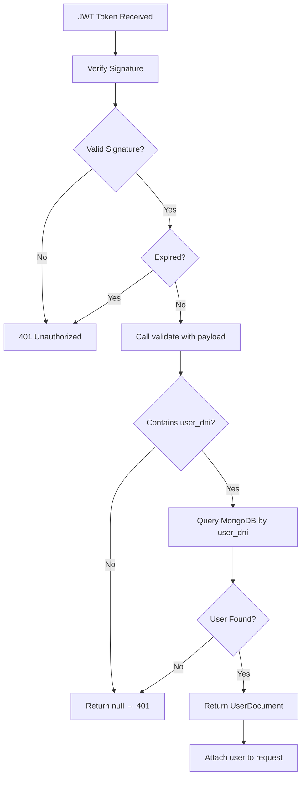

## Overview

The JWT Strategy handles token validation and user authentication for all protected endpoints in Walle. It's implemented using Passport.js and extracts user information from JWT tokens.

**Source**: `src/app/auth/strategies/jwt.strategy.ts`

## JwtStrategy Class

The `JwtStrategy` class extends `PassportStrategy(Strategy)` from `@nestjs/passport` and is responsible for:

- Extracting JWT tokens from request headers
- Validating token signatures
- Looking up authenticated users from MongoDB
- Providing user context to protected routes

### Implementation

```typescript
import { ExtractJwt, Strategy } from 'passport-jwt';
import { PassportStrategy } from '@nestjs/passport';
import { Injectable } from '@nestjs/common';
import { ConfigService } from '@nestjs/config';
import { JWT_SECRET } from 'src/common/constants/settings.contant';
import { UserService } from 'src/app/user/user.service';

@Injectable()
export class JwtStrategy extends PassportStrategy(Strategy) {
    constructor(
        private readonly config: ConfigService,
        private readonly userService: UserService,
    ) {
        super({
            jwtFromRequest: ExtractJwt.fromAuthHeaderAsBearerToken(),
            ignoreExpiration: false,
            secretOrKey: config.get<string>(JWT_SECRET)!
        });
    }

    async validate(payload: any) {
        if ('user_dni' in payload) {
            return await this.userService.findOneDni(payload.user_dni);
        }
        return null;
    }
}
```

**Location**: `src/app/auth/strategies/jwt.strategy.ts:10-28`

## Constructor Configuration

The strategy is configured in the constructor at `src/app/auth/strategies/jwt.strategy.ts:11-20`:

### Token Extraction

<ParamField path="jwtFromRequest" type="function">
  **Method**: `ExtractJwt.fromAuthHeaderAsBearerToken()`
  
  Extracts JWT from the `Authorization` header using Bearer scheme:
  ```
  Authorization: Bearer <token>
  ```
</ParamField>

### Expiration Handling

<ParamField path="ignoreExpiration" type="boolean" default="false">
  When `false`, expired tokens are automatically rejected. Tokens in Walle expire after 8 hours.
</ParamField>

### Secret Key

<ParamField path="secretOrKey" type="string">
  Retrieved from `ConfigService` using the `JWT_SECRET` constant. This secret is used to verify the token's signature.
  
  **Source**: `config.get<string>(JWT_SECRET)`
</ParamField>

## validate() Method

The `validate()` method is called automatically by Passport after the JWT signature is verified.

**Location**: `src/app/auth/strategies/jwt.strategy.ts:22-27`

### Parameters

<ParamField path="payload" type="any">
  The decoded JWT payload containing user information. Expected to include:
  
  - `user_dni` (number): User's DNI used for database lookup
  - Additional claims as needed
</ParamField>

### Return Value

<ResponseField name="return" type="UserDocument | null">
  Returns the full user document from MongoDB if found, or `null` if:
  - The payload doesn't contain `user_dni`
  - The user is not found in the database
  
  When `null` is returned, the request is rejected with a 401 Unauthorized error.
</ResponseField>

### Validation Flow



### User Lookup

The strategy uses `UserService.findOneDni()` to retrieve users:

```typescript
// src/app/user/user.service.ts:14-16
async findOneDni(dni: number): Promise<UserDocument | null> {
    return this.userModel.findOne({ user_dni: dni }).exec();
}
```

This performs a MongoDB query:
```javascript
db.users.findOne({ user_dni: <dni_from_token> })
```

## Usage in Guards

The JWT Strategy is used by `JwtAuthguard` to protect endpoints:

```typescript
// src/common/guards/jwt.guard.ts
import { Injectable, UnauthorizedException } from "@nestjs/common";
import { AuthGuard } from "@nestjs/passport";

@Injectable()
export class JwtAuthguard extends AuthGuard('jwt') {
    handleRequest(err, user, info) {
        if (err || !user) {
            throw err || new UnauthorizedException('Unathorized!');
        }
        return user;
    }
}
```

The guard:
1. Invokes the JWT strategy
2. Checks if `validate()` returned a user
3. Throws `UnauthorizedException` if validation failed
4. Attaches the user to the request object if successful

## Module Registration

The strategy is registered in the AuthModule:

```typescript
// src/app/auth/auth.module.ts
@Module({
    imports: [
        PassportModule, 
        ConfigModule, 
        UserModule,
        JwtModule.registerAsync({
            inject: [ConfigService],
            useFactory: (config: ConfigService) => ({
                secret: config.get<string>(JWT_SECRET),
                signOptions: {
                    expiresIn: '8h'
                }
            })
        })
    ],
    providers: [JwtStrategy]
})
export class AuthModule { }
```

**Location**: `src/app/auth/auth.module.ts:9-24`

## Configuration Requirements

### Environment Variables

<ParamField path="JWT_SECRET" type="string" required>
  Secret key for signing and verifying JWT tokens. Must be configured in your environment:
  
  ```bash
  JWT_SECRET=your-secure-secret-key
  ```
</ParamField>

### Database Connection

<ParamField path="DELTA_DISPATCH_DB_NAME" type="string" required>
  MongoDB database name where users are stored. Referenced in `UserService` at `src/app/user/user.service.ts:10`.
</ParamField>

## User Document Schema

The `validate()` method returns a `UserDocument` with the following key fields:

<ResponseField name="user_dni" type="number">
  Unique DNI identifier used for authentication
</ResponseField>

<ResponseField name="user_username" type="string">
  Username
</ResponseField>

<ResponseField name="user_email" type="string">
  Email address
</ResponseField>

<ResponseField name="user_role" type="string" default="Operador">
  User's role in the system
</ResponseField>

<ResponseField name="user_state" type="boolean" default="true">
  Whether the user account is active
</ResponseField>

<ResponseField name="user_isroot" type="boolean">
  Root/superuser flag
</ResponseField>

<ResponseField name="user_admin" type="boolean">
  Administrator flag
</ResponseField>

**Full schema**: `src/app/user/schema/user.schema.ts:11-250`

## Error Handling

### Invalid Token

When the JWT signature is invalid or the token is malformed:

```json
{
  "statusCode": 401,
  "message": "Unathorized!",
  "error": "Unauthorized"
}
```

### User Not Found

When `validate()` returns `null` (user_dni not in payload or user not in database):

```json
{
  "statusCode": 401,
  "message": "Unathorized!",
  "error": "Unauthorized"
}
```

### Expired Token

When the token is older than 8 hours:

```json
{
  "statusCode": 401,
  "message": "Unathorized!",
  "error": "Unauthorized"
}
```

## Best Practices

- **Token Payload**: Always include `user_dni` in JWT payload when signing tokens
- **User Validation**: The strategy performs a fresh database lookup on every request for security
- **Null Handling**: Ensure user accounts exist before issuing tokens
- **Secret Rotation**: Rotate `JWT_SECRET` periodically for enhanced security
- **Error Messages**: Generic "Unathorized!" message prevents information leakage