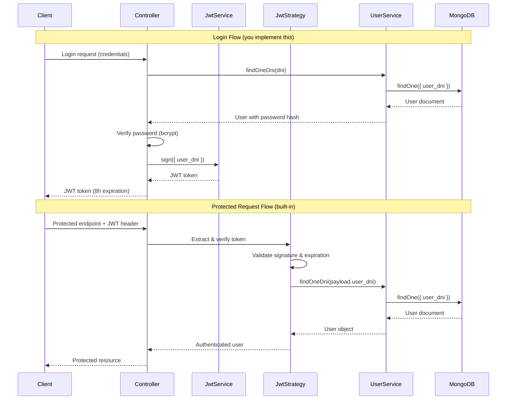

## Overview

Walle uses **JWT (JSON Web Token)** authentication with **Passport** strategies to secure API endpoints. The authentication system validates user credentials from MongoDB and issues time-limited access tokens.

## Authentication Flow



## JWT Strategy Implementation

The JWT validation logic is implemented in `src/app/auth/strategies/jwt.strategy.ts`:

```typescript
import { ExtractJwt, Strategy } from 'passport-jwt';
import { PassportStrategy } from '@nestjs/passport';
import { Injectable } from '@nestjs/common';
import { ConfigService } from '@nestjs/config';
import { JWT_SECRET } from 'src/common/constants/settings.contant';
import { UserService } from 'src/app/user/user.service';

@Injectable()
export class JwtStrategy extends PassportStrategy(Strategy) {
  constructor(
    private readonly config: ConfigService,
    private readonly userService: UserService,
  ) {
    super({
      jwtFromRequest: ExtractJwt.fromAuthHeaderAsBearerToken(),
      ignoreExpiration: false,
      secretOrKey: config.get<string>(JWT_SECRET)!
    });
  }

  async validate(payload: any) {
    if ('user_dni' in payload) {
      return await this.userService.findOneDni(payload.user_dni);
    }
    return null;
  }
}
```

### Key Components

#### Token Extraction

```typescript
jwtFromRequest: ExtractJwt.fromAuthHeaderAsBearerToken()
```

Extracts the JWT from the `Authorization` header in the format:

```
Authorization: Bearer <token>
```

#### Token Validation

```typescript
ignoreExpiration: false,
secretOrKey: config.get<string>(JWT_SECRET)!
```

- **Expiration checking enabled**: Tokens expire after 8 hours
- **Secret key**: Loaded from environment variables via ConfigService
- **Automatic verification**: Passport verifies signature and expiration

#### User Lookup

```typescript
async validate(payload: any) {
  if ('user_dni' in payload) {
    return await this.userService.findOneDni(payload.user_dni);
  }
  return null;
}
```

After token verification, the strategy:
1. Extracts `user_dni` from the JWT payload
2. Queries MongoDB for the user document
3. Returns the user object (attached to request) or null (authentication fails)

<Info>
The `validate()` method is called automatically by Passport after successful JWT verification. The returned user object is attached to the request as `req.user`.
</Info>

## Auth Module Configuration

The `AuthModule` configures JWT settings and dependencies:

```typescript
import { Module } from "@nestjs/common";
import { JwtStrategy } from "./strategies/jwt.strategy";
import { JwtModule } from "@nestjs/jwt";
import { ConfigModule, ConfigService } from "@nestjs/config";
import { JWT_SECRET } from "src/common/constants/settings.contant";
import { PassportModule } from "@nestjs/passport";
import { UserModule } from "../user/user.module";

@Module({
  imports: [
    PassportModule, 
    ConfigModule, 
    UserModule,
    JwtModule.registerAsync({
      inject: [ConfigService],
      useFactory: (config: ConfigService) => ({
        secret: config.get<string>(JWT_SECRET),
        signOptions: {
          expiresIn: '8h'
        }
      })
    })
  ],
  providers: [JwtStrategy]
})
export class AuthModule { }
```

### Module Dependencies

- **PassportModule**: Provides Passport integration
- **ConfigModule**: Injects environment configuration
- **UserModule**: Provides UserService for user lookup
- **JwtModule**: Handles token signing and verification

### JWT Configuration

```typescript
JwtModule.registerAsync({
  inject: [ConfigService],
  useFactory: (config: ConfigService) => ({
    secret: config.get<string>(JWT_SECRET),
    signOptions: {
      expiresIn: '8h'  // Tokens expire after 8 hours
    }
  })
})
```

<Warning>
Tokens expire after **8 hours**. Clients must implement token refresh logic or re-authenticate when tokens expire.
</Warning>

## User Service Integration

The `UserService` retrieves user data from MongoDB's DeltaDispatch database:

```typescript
import { Injectable } from "@nestjs/common";
import { InjectModel } from "@nestjs/mongoose";
import { Model } from "mongoose";
import { User, UserDocument } from "./schema/user.schema";
import { DELTA_DISPATCH_DB_NAME } from "src/common/constants/database.constant";

@Injectable()
export class UserService {
  constructor(
    @InjectModel(User.name, DELTA_DISPATCH_DB_NAME)
    private readonly userModel: Model<UserDocument>,
  ) { }

  async findOneDni(dni: number): Promise<UserDocument | null> {
    return this.userModel.findOne({ user_dni: dni }).exec();
  }
}
```

### User Lookup by DNI

The service queries MongoDB by the user's DNI (Document Number ID):

```typescript
async findOneDni(dni: number): Promise<UserDocument | null> {
  return this.userModel.findOne({ user_dni: dni }).exec();
}
```

<Note>
DNI (Documento Nacional de Identidad) is used as the unique identifier in the JWT payload and MongoDB user collection.
</Note>

## Token Structure

Walle JWT tokens contain the following payload:

```json
{
  "user_dni": 12345678,
  "iat": 1709481600,
  "exp": 1709510400
}
```

| Field | Description |
|-------|-------------|
| `user_dni` | User's DNI (used for lookup) |
| `iat` | Issued at timestamp (Unix time) |
| `exp` | Expiration timestamp (iat + 8 hours) |

## Protecting Endpoints

Use the `@UseGuards(AuthGuard('jwt'))` decorator to protect routes:

```typescript
import { Controller, Get, UseGuards } from '@nestjs/common';
import { AuthGuard } from '@nestjs/passport';
import { PointsService } from './points.service';

@Controller('points')
export class PointsController {
  constructor(private readonly pointsService: PointsService) { }

  @Get()
  @UseGuards(AuthGuard('jwt'))  // Requires valid JWT
  async findAll() {
    // Only accessible with valid JWT token
    return this.pointsService.findAll();
  }
}
```

### Accessing the Authenticated User

Extract the user object from the request using the `@Req()` decorator:

```typescript
import { Controller, Get, UseGuards, Req } from '@nestjs/common';
import { AuthGuard } from '@nestjs/passport';
import { Request } from 'express';

@Controller('points')
export class PointsController {
  @Get('my-points')
  @UseGuards(AuthGuard('jwt'))
  async getMyPoints(@Req() req: Request) {
    const user = req.user;  // User object from JWT validation
    // Filter points by user's IMEI or other criteria
    return this.pointsService.findByUser(user);
  }
}
```

### Custom Decorator for User Extraction

Create a custom decorator for cleaner code:

```typescript
import { createParamDecorator, ExecutionContext } from '@nestjs/common';

export const CurrentUser = createParamDecorator(
  (data: unknown, ctx: ExecutionContext) => {
    const request = ctx.switchToHttp().getRequest();
    return request.user;
  },
);
```

Usage:

```typescript
import { Controller, Get, UseGuards } from '@nestjs/common';
import { AuthGuard } from '@nestjs/passport';
import { CurrentUser } from './decorators/current-user.decorator';
import { UserDocument } from './user/schema/user.schema';

@Controller('points')
export class PointsController {
  @Get('my-points')
  @UseGuards(AuthGuard('jwt'))
  async getMyPoints(@CurrentUser() user: UserDocument) {
    // Clean access to authenticated user
    return this.pointsService.findByUser(user);
  }
}
```

## Environment Configuration

Ensure your `.env` file contains the JWT secret:

```bash
# JWT Configuration
JWT_SECRET=your-secret-key-here

# MongoDB URIs
MONGO_DELTA_DISPATCH_URI=mongodb://localhost:27017/delta_dispatch
MONGO_AUTHSOFTWARE_URI=mongodb://localhost:27017/auth_software
```

<Warning>
**Security Best Practices:**
- Use a strong, randomly generated secret (minimum 32 characters)
- Never commit secrets to version control
- Rotate secrets periodically in production
- Use different secrets for development and production
</Warning>

## Authentication Error Responses

### Missing Token

```json
{
  "statusCode": 401,
  "message": "Unauthorized"
}
```

### Invalid Token

```json
{
  "statusCode": 401,
  "message": "Unauthorized"
}
```

### Expired Token

```json
{
  "statusCode": 401,
  "message": "Unauthorized"
}
```

### User Not Found

```json
{
  "statusCode": 401,
  "message": "Unauthorized"
}
```

<Info>
Passport returns a generic "Unauthorized" message for all authentication failures to prevent information leakage.
</Info>

## Example: Using the Authentication Infrastructure

<Note>
  The auth infrastructure is implemented but you'll need to create your own auth controller with login endpoints. Below is an example of how to implement and use it.
</Note>

### 1. Implement Login Endpoint

```typescript
import { Controller, Post, Body, UnauthorizedException } from '@nestjs/common';
import { JwtService } from '@nestjs/jwt';
import { UserService } from '../user/user.service';
import * as bcrypt from 'bcrypt';

@Controller('auth')
export class AuthController {
  constructor(
    private jwtService: JwtService,
    private userService: UserService
  ) {}

  @Post('login')
  async login(@Body() loginDto: { user_dni: number; password: string }) {
    const user = await this.userService.findOneDni(loginDto.user_dni);
    
    if (!user || !await bcrypt.compare(loginDto.password, user.user_password)) {
      throw new UnauthorizedException('Invalid credentials');
    }
    
    const payload = { user_dni: user.user_dni };
    return {
      access_token: this.jwtService.sign(payload)
    };
  }
}
```

### 2. Protect Endpoints with @Auth()

```typescript
import { Controller, Get } from '@nestjs/common';
import { Auth } from 'src/common/decorators';
import { User } from 'src/common/decorators';

@Controller('protected')
export class MyController {
  
  @Get()
  @Auth()  // Requires JWT authentication
  getData(@User() user) {
    // user is populated by JwtStrategy.validate()
    return {
      message: 'Authenticated',
      userDni: user.user_dni
    };
  }
}
```

### 3. JWT Token Flow

1. Client sends credentials to your login endpoint
2. Server validates and signs JWT with `user_dni` in payload
3. Client receives JWT token (valid for 8 hours)
4. Client includes token in `Authorization: Bearer <token>` header
5. `JwtStrategy.validate()` looks up user by DNI from payload
6. Request proceeds with `user` object populated

## Testing Authentication

Test the JwtStrategy and guards:

```typescript
import { Test } from '@nestjs/testing';
import { JwtStrategy } from './strategies/jwt.strategy';
import { UserService } from '../user/user.service';
import { ConfigService } from '@nestjs/config';

describe('JwtStrategy', () => {
  let strategy: JwtStrategy;
  let userService: UserService;

  beforeEach(async () => {
    const module = await Test.createTestingModule({
      providers: [
        JwtStrategy,
        {
          provide: UserService,
          useValue: { findOneDni: jest.fn() }
        },
        {
          provide: ConfigService,
          useValue: { get: jest.fn().mockReturnValue('test-secret') }
        }
      ]
    }).compile();

    strategy = module.get<JwtStrategy>(JwtStrategy);
    userService = module.get<UserService>(UserService);
  });

  it('should validate user with valid DNI in payload', async () => {
    const mockUser = { user_dni: 12345678, user_name: 'Test' };
    jest.spyOn(userService, 'findOneDni').mockResolvedValue(mockUser as any);

    const result = await strategy.validate({ user_dni: 12345678 });
    
    expect(result).toEqual(mockUser);
    expect(userService.findOneDni).toHaveBeenCalledWith(12345678);
  });

  it('should return null if DNI not in payload', async () => {
    const result = await strategy.validate({ sub: 'some-id' });
    expect(result).toBeNull();
  });
});
```

## Additional Security Considerations

<CardGroup cols={2}>
  <Card title="HTTPS Only" icon="lock">
    Always use HTTPS in production to prevent token interception
  </Card>
  <Card title="Token Storage" icon="database">
    Store tokens securely on the client (httpOnly cookies or secure storage)
  </Card>
  <Card title="Rate Limiting" icon="shield">
    Implement rate limiting on login endpoints to prevent brute force attacks
  </Card>
  <Card title="Token Refresh" icon="rotate">
    Implement refresh tokens for better UX with 8-hour expiration
  </Card>
</CardGroup>